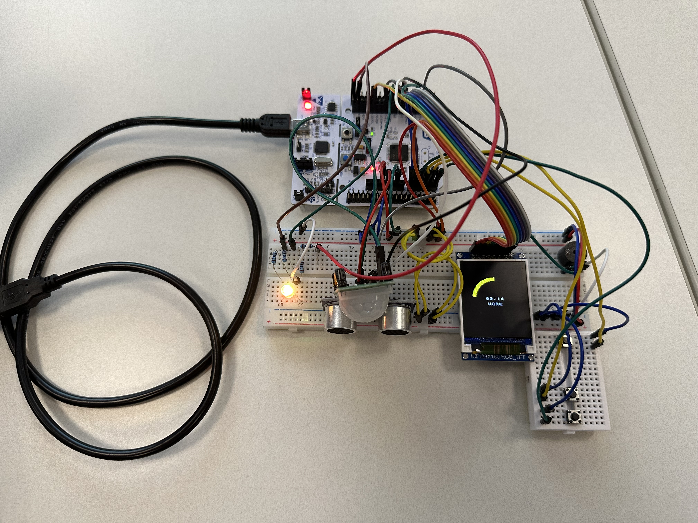

# Auto-Pomodoro

Auto-Pomodoro is an embedded productivity timer built on an STM32L476RG microcontroller.  
It combines a classic Pomodoro workflow with presence sensing so the timer runs only when someone is actively at the desk.

## System Photo

## Project Overview

This project implements a self-pausing Pomodoro system with:

- **Work/Break countdown logic** (default: 20 min work, 5 min break)
- **Automatic pause/resume behavior** based on motion + distance detection
- **On-device UI** on an ST7735 SPI TFT display
- **Visual status feedback** using RGB LED breathing/solid color modes
- **Audible notification** with buzzer when switching between work and break periods
- **Button-based configuration** for adjusting work/break durations

The timer is intended for desk use: when presence is detected, the countdown runs; when presence is lost, the timer pauses (or safely resets in specific near-expiration cases).

## Key Features

### 1) Presence-Aware Timer Control
- Uses a PIR motion sensor interrupt to track recent movement.
- Uses an ultrasonic distance measurement cycle to verify user proximity.
- Presence is considered valid when:
	- measured distance is below the configured threshold, and
	- motion was detected recently.
- If no presence is detected, the timer pauses.

### 2) Pomodoro State Machine
- Two alternating states:
	- **Work session**
	- **Break session**
- Countdown runs once per second.
- On expiration, the system switches state and emits a buzzer pulse.

### 3) Adjustable Session Durations
- Default durations:
	- `working_period = 20` minutes
	- `break_period = 5` minutes
- Buttons allow increment/decrement of each period through an edit mode.

### 4) Real-Time Visual Interface
- ST7735-based display shows:
	- remaining time
	- current mode (WORK/BREAK)
	- edit screens for duration setup
	- progress rendering
- A framebuffer approach is used for screen drawing.

### 5) RGB LED Status Signaling
- **Breathing effect** while actively working/timing.
- Color changes communicate context:
	- work-like active mode (amber-toned blend)
	- break mode (purple)
	- edit modes and idle states (solid/dim patterns)

## Hardware/Peripheral Usage

The firmware is built around STM32 HAL peripherals:

- **SPI1**: ST7735 TFT display communication
- **TIM1 (Input Capture)**: ultrasonic echo pulse width capture
- **TIM2 (Periodic)**: ultrasonic trigger/measurement scheduling
- **TIM3 (PWM + Periodic)**: RGB LED breathing intensity control
- **TIM4 (Periodic, 1 Hz behavior)**: Pomodoro countdown timing
- **GPIO EXTI**:
	- PIR motion sensor interrupt
	- button interrupts (`MODE`, `UP`, `DOWN`) with debounce
- **GPIO Output**: buzzer trigger and ultrasonic trigger pulse

## Pin Assignments (from project configuration)

- `BUZZ`: `PC0`
- `B_MODE`: `PC1`
- `B_DOWN`: `PA4`
- `B_UP`: `PB0`
- `LED_B`: `PC6`
- `LED_G`: `PC7`
- `LED_R`: `PC8`
- `US_ECHO`: `PA8`
- `US_TRIG`: `PA9`
- `MS` (motion sensor input): `PA10`
- Display control:
	- `RST`: `PA0`
	- `DC`: `PA1`
	- `CS`: `PB6`

## Firmware Behavior Summary

- Main loop continuously renders the display based on current operating mode.
- Interrupt callbacks handle:
	- timer ticks,
	- sensor sampling,
	- capture events,
	- button events.
- The system is primarily event-driven, with timing-critical tasks in timer interrupts.

## Project Structure

- `Core/Src/main.c`: main application logic, drivers, callbacks, state machines
- `Core/Inc/main.h`: pin definitions, constants, state enums
- `Core/Inc/font.h`: 8x8 font table used for text rendering
- `Final_Project.ioc`: STM32CubeMX project configuration
- `Drivers/`: STM32 HAL + CMSIS device support

## Build and Flash

This repository is organized as a typical STM32CubeIDE-generated project.

1. Open **STM32CubeIDE**.
2. Import the project from this repository folder.
3. Ensure the target is the STM32L476RG device.
4. Build the project.
5. Flash to hardware using ST-LINK.

Generated linker scripts are included:

- `STM32L476RGTX_FLASH.ld`
- `STM32L476RGTX_RAM.ld`

## How to Use

1. Power the board and connected peripherals.
2. System starts in normal timer view.
3. Use `MODE` to cycle edit mode:
	 - normal view → edit work duration → edit break duration → normal view
4. Use `UP`/`DOWN` to adjust selected duration.
5. Return to normal mode to apply/run with selected timing.
6. Stay within detection range and motion window for active countdown.

## Notes

- Sensor thresholds and timing constants are configurable in `main.h`.
- Debounce handling is implemented in EXTI callback logic.
- The project includes both generated code and custom application code in USER CODE sections.

